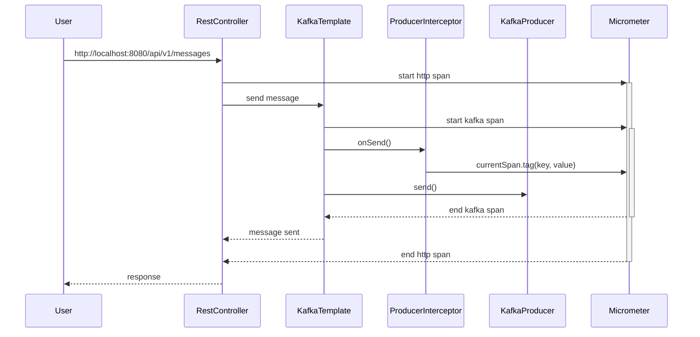

# 

## Description

When adding a tag to the current span during the sending of a kafka message using KafkaTemplate,
the tag gets added to another span because the KafkaTemplate doesn't open the scope for the started observation.

```java
private CompletableFuture<SendResult<K, V>> observeSend(final ProducerRecord<K, V> producerRecord) {
    Observation observation = ...
    try {
        observation.start();
        // Should be wrappet in try(Scope scope = observation.openScope()) { ... }
        return doSend(producerRecord, observation);
    } catch (RuntimeException ex) {
        ...
    }
```

See explanation and example here: https://github.com/micrometer-metrics/micrometer/wiki/Migrating-to-new-1.10.0-Observation-API#you-want-to-do-everything-manually-or-you-want-to-signal-events

```java
Observation observation = ...;
observation.start();
try (Scope scope = observation.openScope()) {
  // do some work
  observation.event("look what happened");
  return something;
} catch (Exception exception) {
  ...
}
```

## Reproduction scenario

### Given

- Kafka broker (See Docker compose.yml)
- Zipkin server (See Docker compose.yml)
- Spring web application with Micrometer and Zipkin
- Rest controller with injected Kafka template
- Kafka template with injected producer interceptor
- Producer interceptor with injected micrometer tracer

### When

Simplified logical flow



### Then

- The added tags and up

### Expected